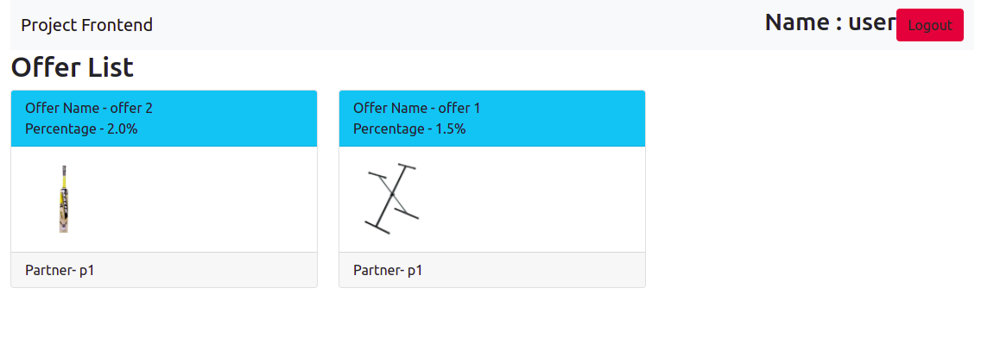
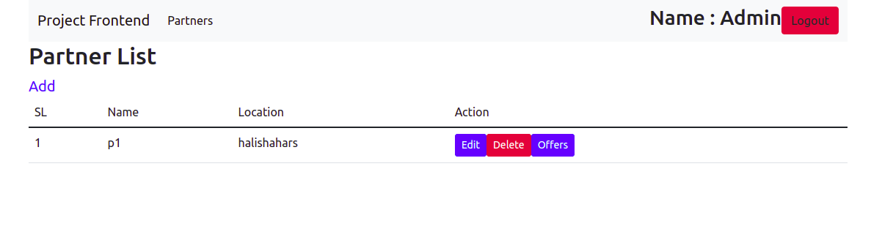
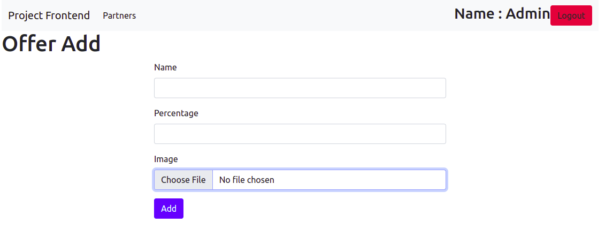
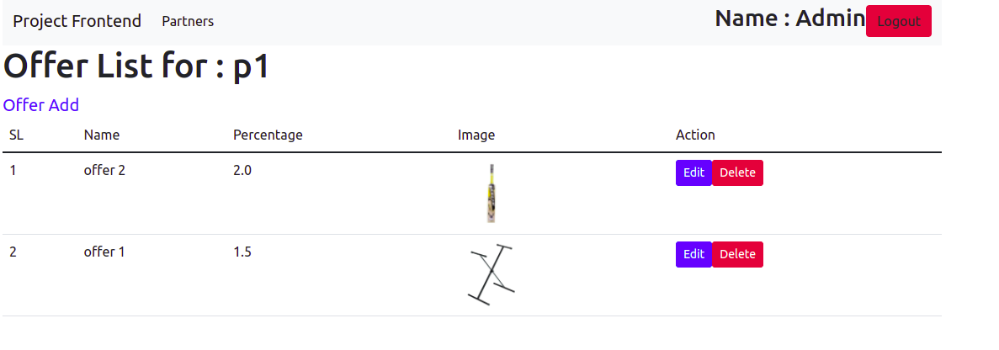

# Application for Interview
## Run Project:

#### add your desire endpoint and secret
#### REACT_APP_SERVER_URL="http://localhost:8005"
#### REACT_APP_SERVER_CLIENT_ID=2
#### REACT_APP_SERVER_CLIENT_SECRET=ICwtFSRsxMNoZ76kYDzwSjCnJmjjRbuS70RoRrBP
#### and then:
#### npm start

* ## This is an api based application. Here it is Frontend and React has been used.
* ## Features
    > Partner
    >>
    >> Offer.
    >>
    >> Admin can do CRUD partner and offer.
    >>
    >> General user can only view offers.  
* ## Some patterns from react whcih has been use in applciation, those are : 
    > Class Component State Management.
    >
    > Lifecycle Methods.
    >
    > Context Api For Login Handle.
    >
    > Controlled Component.
    >
    > Functional Component Hooks.
    >>
    >> useState.
    >>
    >> useEffect.

    * ## Some Screenshot from Application
    
    
    
    
    
    
   
 
