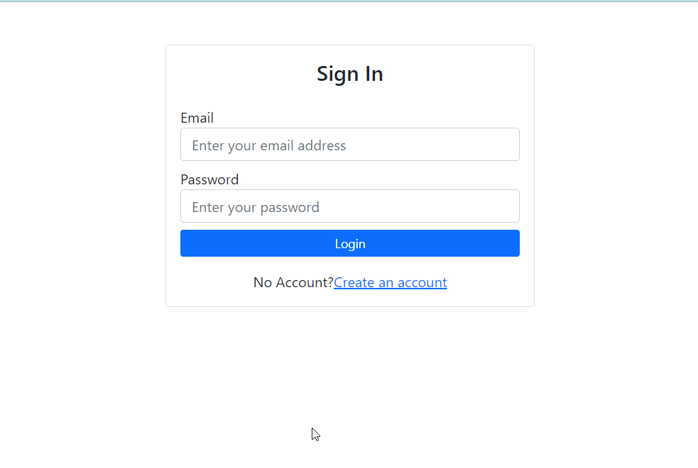

# Application for Surveys
## Run Project:

#### add your desire endpoint and secret
#### REACT_APP_SERVER_URL="http://localhost:8002"
#### REACT_APP_SERVER_CLIENT_ID=2
#### REACT_APP_SERVER_CLIENT_SECRET=ICwtFSRsxMNoZ76kYDzwSjCnJmjjRbuS70RoRrBP
#### REACT_APP_FRONTEND_SERVER_URL="http://localhost:3000"
#### and then:
#### npm start

* ## This is an api based application. Here it is Frontend and React has been used.
* ## Features
    > ## Topic of Feedback
    >> #### Feedback wise Questions
    >>> #### Share Form unique
    >>> #### Question Answers  (Random User ans Surveys)
* ## Some patterns from react whcih has been use in applciation, those are : 
    > Function Component State Management.
    >
    > Lifecycle Methods.
    >
    > Context Api For Login, Registation, Logout Handle.
    >
    > Controlled Component.
    >
    > Functional Component Hooks.
    >>
    >> useState.
    >>
    >> useEffect.
    >>
    >> createContext.
    >>
    >> useNavigate.

    * ## Some Screenshot from Application
    > #### Login Page
    
    > #### Registation Page
    
    > #### Topic of Feedback List [Created User wise data list]
    
    > #### Create and Edit page of Feedback
    
    > #### Question List and Create Page
    
    > #### Random User Submit their Feedback on this Form
    
    > #### Surveys Report based on Surveys Form
    
   
 
